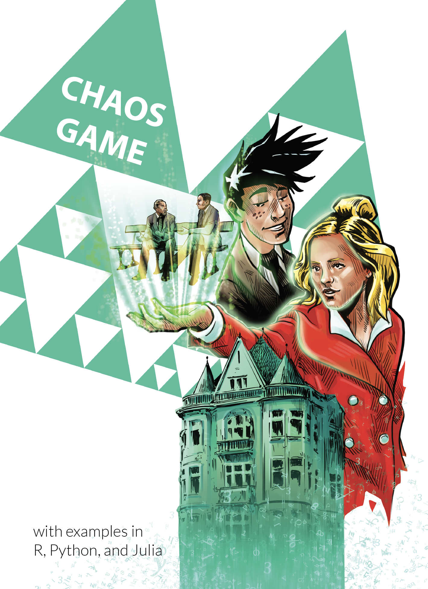

# Chaos Game

Are you curious about fractals? The Chaos Game is the book for you.

You will learn the mathematical basis behind these figures, find out what algorithm can be used to code them, write code in your favourite programming language (Python, R, Julia?) and also explore the bibliographies of three mathematicians associated with the development of mathematics around these shapes.

This is the next book in the Beta Bit series for anyone interested in computational mathematics and data analysis. 

Get the full book online: https://betaandbit.github.io/ChaosGame/

## Other languages

* Polish version: ,,Gra w Chaos'' https://github.com/BetaAndBit/chaos

## Other books

* https://www.mi2.ai/beta-bit.html
